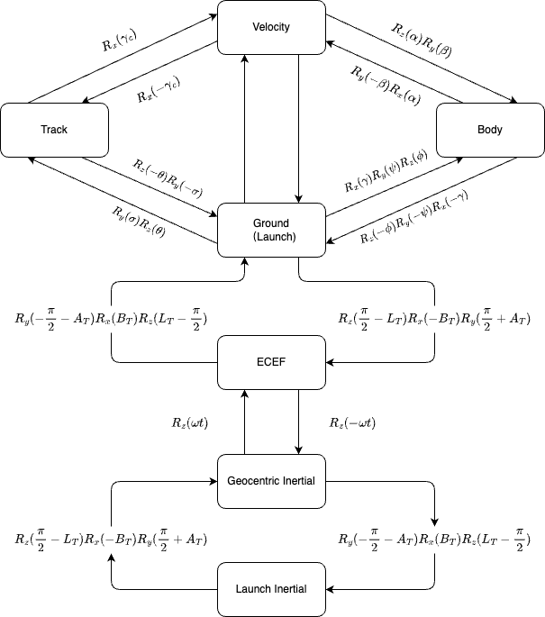

# Coordinate Transformation Toolbox - Aerospace Extension

## Software requirements

- MATLAB > R2019a

> Some machines may not be able to display UTF-8 characters due to backward configuration. Please use an advanced editor to open and view the original file.

## Design Principle

This toolbox is designed based on the MATLAB `Mapping` toolbox. By ensuring high similarity and readability with the official API, it reduces the learning cost for users and the testing cost for developers.

Its main design principles are as follows

- Function names adopt name pattern in the `Mapping` toolbox, while
  - add prefix `c` to the coordiate transformation function
  - add prefix `r` to the rotation function
  - add prefix `u` to the unit conversion function
  - add prefix `get_` to the calculation function
- Input includes parameter type verification
- Output dimension flexibility
- Only use MATLAB builtin functions
- Reference ellipsoid model is written in object-oriented form to facilitate subsequent expansion
- Encoding only uses UTF-8

> Dotted line in the schematic diagram indicates indirect transformation, which may cause cumulative errors
